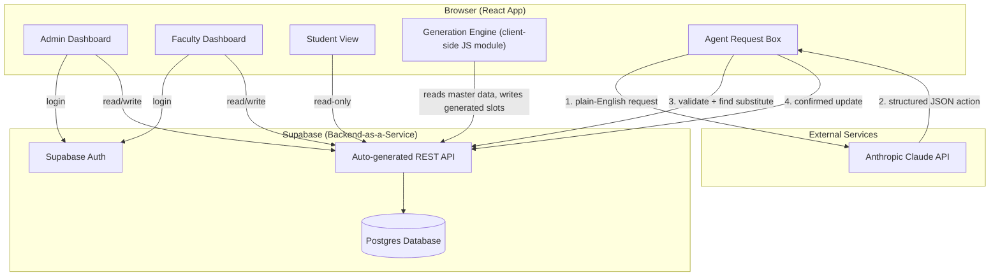
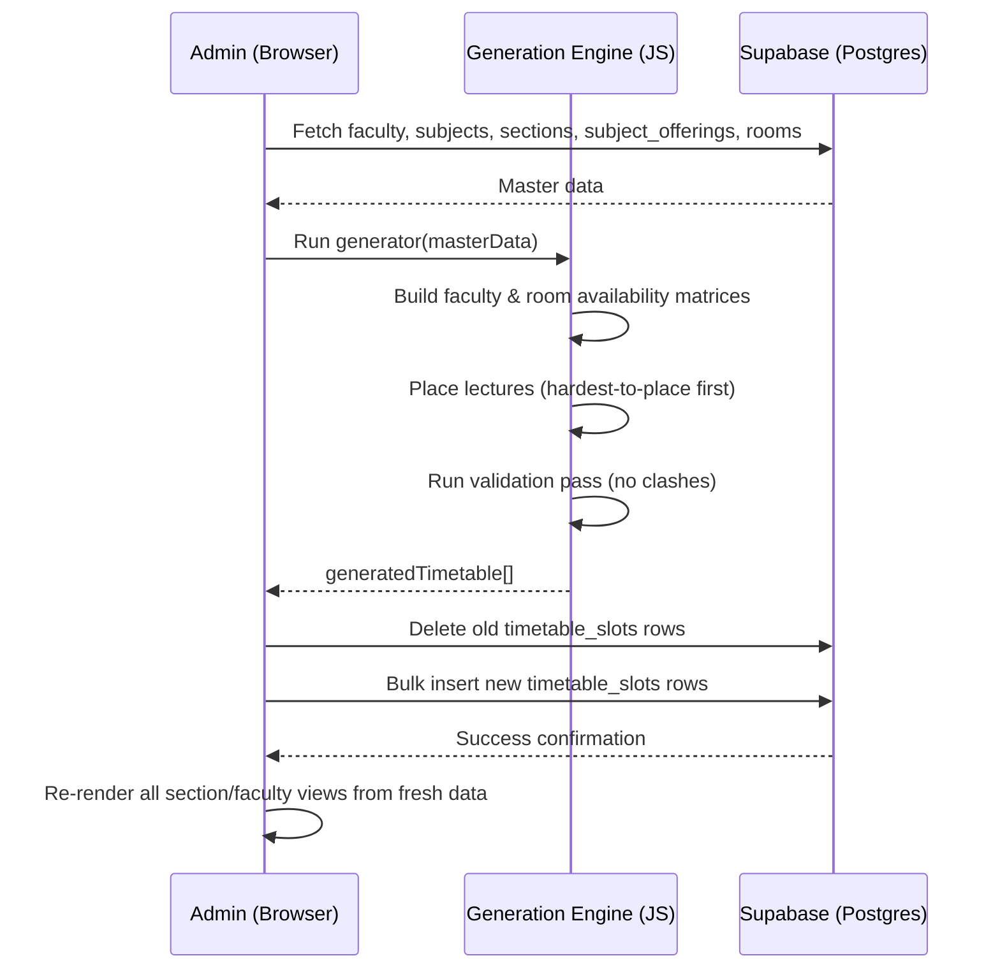
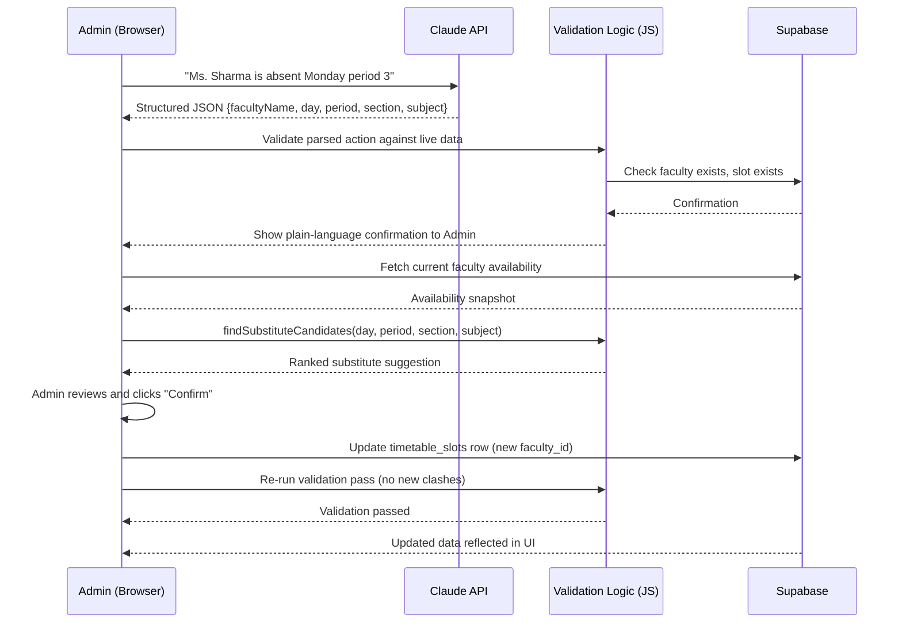
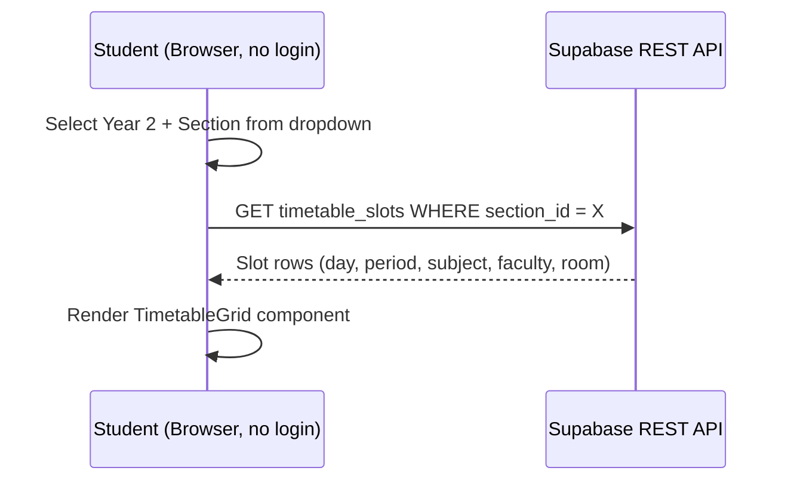

# Architecture — Smart Timetable Auto-Generator with AI Reassignment Agent

Status: Finalized Day 2. Source of truth for all implementation days (3–10).

## 1. Tech Stack Summary

- **Frontend:** React (JS, Vite) + Tailwind CSS
- **Backend:** Supabase (Postgres + auto REST API)
- **Auth:** Supabase Auth (email/password)
- **AI:** Anthropic Claude API (`claude-sonnet-4-6`) — used only for natural-language parsing in the reassignment agent
- **Hosting:** Vercel (free tier)

No custom backend server is built. The React app talks directly to Supabase (via its JS client) and directly to the Anthropic API for the agent's parsing step. This keeps the architecture simple and buildable in the remaining days.

---

## 2. Component Diagram

**Key design decision:** the generation engine and substitute-finding logic run as **client-side JavaScript modules**, not a separate backend service. Given the solo-builder, 9-day timeline, this avoids building/deploying/maintaining a custom server. Supabase provides the only "backend" needed — a database with a REST API and auth.

---

## 3. Data Flow — Timetable Generation

---

## 4. Data Flow — AI Reassignment Agent

**Critical safety design:** Claude is used **only** to parse natural language into a structured action and to phrase the proposal back to the admin in plain English. The actual substitute-matching logic and the final write to the database are handled entirely by deterministic JS code — never by the LLM directly. This was already a PRD requirement (FR-8, FR-9) and is preserved unchanged here.

---

## 5. Request Lifecycle — Student Viewing a Timetable (representative simple case)

Public read access to `timetable_slots` (and related lookup tables) is granted via Supabase Row Level Security (RLS) policies — read-only, no auth required. Write access requires an authenticated Admin session. This is finalized in Day 9's RLS lockdown step per the Blueprint, but the policy design itself is decided today (see Section 6).

---

## 6. External Services

| Service | Purpose | Auth method | Notes |
|---|---|---|---|
| Supabase | Database, REST API, Auth | Project URL + anon/public key (client), service handles auth internally | Free tier; RLS enforces access control |
| Anthropic Claude API | Natural-language parsing for the reassignment agent | API key (handled via environment variable, never exposed in committed code) | Only called from the Agent Request flow — not used anywhere else in the app |
| Vercel | Hosting/deployment | GitHub integration (auto-deploy on push) | Free tier; environment variables configured in Vercel dashboard, not committed to the repo |

---

## 7. Why This Architecture Fits the Timeline

- **No custom backend to build or deploy** — Supabase removes an entire layer of work.
- **Client-side generation engine** — testable independently (as already planned for Day 3), no server deployment step needed for the core "hero feature."
- **AI is scoped narrowly** — only the parsing step touches the LLM; everything safety-critical (matching, writing data) stays in deterministic code, which is both faster to build and easier to debug than an LLM-driven alternative.
- **Single hosting target** — one Vercel deployment serves all three roles (Admin/Faculty/Student), keeping Day 10 deployment simple.

No conflicts with the PRD or Implementation Blueprint were found — this architecture implements exactly what was scoped on Day 1.
