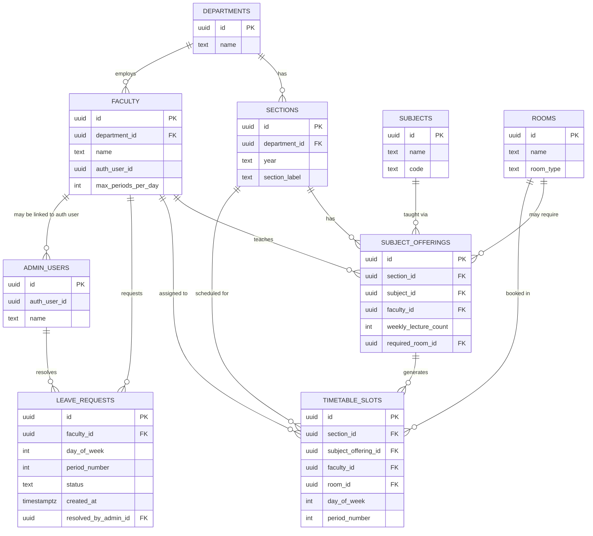

# Database Schema — Smart Timetable Auto-Generator

Status: Finalized Day 2. This is the exact schema Day 2 setup (per the Implementation Blueprint) will create in Supabase.

## 1. Entity-Relationship Diagram

---

## 2. Tables & Fields

### `departments`
| Field | Type | Notes |
|---|---|---|
| id | uuid, PK | default `gen_random_uuid()` |
| name | text | e.g. "Computer Science & Engineering" |

### `faculty`
| Field | Type | Notes |
|---|---|---|
| id | uuid, PK | |
| department_id | uuid, FK → departments.id | |
| name | text | |
| auth_user_id | uuid, nullable | links to Supabase `auth.users.id` once faculty account is created |
| max_periods_per_day | int | default 6; hard constraint used by the generator |

### `subjects`
| Field | Type | Notes |
|---|---|---|
| id | uuid, PK | |
| name | text | e.g. "Data Structures" |
| code | text | e.g. "CS201" |

### `sections`
| Field | Type | Notes |
|---|---|---|
| id | uuid, PK | |
| department_id | uuid, FK → departments.id | |
| year | text | fixed to "2nd Year" for v1.0 |
| section_label | text | "A" through "F" |

### `rooms`
| Field | Type | Notes |
|---|---|---|
| id | uuid, PK | |
| name | text | e.g. "Lab 3", "Room 204" |
| room_type | text | "lecture" or "lab" |

### `subject_offerings` (the core "rules" table — one row per subject taught in a section)
| Field | Type | Notes |
|---|---|---|
| id | uuid, PK | |
| section_id | uuid, FK → sections.id | |
| subject_id | uuid, FK → subjects.id | |
| faculty_id | uuid, FK → faculty.id | who teaches this subject in this section |
| weekly_lecture_count | int | fixed number of lectures/week (hard constraint) |
| required_room_id | uuid, nullable, FK → rooms.id | null if no specific room required |
| **Constraint:** | UNIQUE(section_id, subject_id) | a subject appears once per section as an offering |

### `timetable_slots` (the generated output — one row per placed lecture)
| Field | Type | Notes |
|---|---|---|
| id | uuid, PK | |
| section_id | uuid, FK → sections.id | |
| subject_offering_id | uuid, FK → subject_offerings.id | |
| faculty_id | uuid, FK → faculty.id | denormalized for fast queries (also derivable via subject_offering) |
| room_id | uuid, nullable, FK → rooms.id | |
| day_of_week | int | 0=Monday … 4=Friday |
| period_number | int | 1–8 |
| **Constraint:** | UNIQUE(section_id, day_of_week, period_number) | a section can't have two lectures in the same slot |

### `leave_requests`
| Field | Type | Notes |
|---|---|---|
| id | uuid, PK | |
| faculty_id | uuid, FK → faculty.id | |
| day_of_week | int | |
| period_number | int | |
| status | text | 'pending' \| 'handled' |
| created_at | timestamptz | default now() |
| resolved_by_admin_id | uuid, nullable, FK → admin_users.id | set when handled |

### `admin_users`
| Field | Type | Notes |
|---|---|---|
| id | uuid, PK | |
| auth_user_id | uuid | links to Supabase `auth.users.id` |
| name | text | |

---

## 3. Key Constraints (enforced at the database level)

- `UNIQUE(section_id, day_of_week, period_number)` on `timetable_slots` — guarantees a section is never double-booked in its own grid (the generator additionally guarantees no faculty clash across sections at the application layer, since Postgres alone can't easily express "this faculty_id isn't already busy elsewhere at this exact day/period" without a similar per-faculty uniqueness constraint).
- **Additional recommended constraint:** `UNIQUE(faculty_id, day_of_week, period_number)` on `timetable_slots` — this directly enforces "no faculty double-booked" at the database level too, as a safety net beneath the application-level check. **This was not explicit in the Day 1 blueprint and is a Day 2 improvement** — it costs nothing and adds a hard guarantee against the single most important rule (FR-2) even if application logic has a bug.
- `UNIQUE(section_id, subject_id)` on `subject_offerings` — a subject can't be offered twice in the same section.
- Foreign keys with `ON DELETE RESTRICT` (default) across the board, so master data can't be silently deleted while referenced by a generated timetable.

---

## 4. Row Level Security (RLS) Policy Design

Decided now, implemented progressively (open during Days 2–8 for development speed, fully locked down Day 9 per the Blueprint):

| Table | Public read | Authenticated write |
|---|---|---|
| departments, subjects, sections, rooms, faculty, subject_offerings | ✅ Yes | Admin only |
| timetable_slots | ✅ Yes | Admin only (generation + agent-driven updates) |
| leave_requests | ❌ No (faculty/admin only) | Faculty can insert own; Admin can update status |
| admin_users | ❌ No | Admin only, self-managed |

---

## 5. Validation Against PRD User Stories

| PRD Requirement | Covered by |
|---|---|
| FR-1: Auto-generate for all 6 sections | `sections`, `subject_offerings`, `timetable_slots` |
| FR-2: No faculty double-booking | `UNIQUE(faculty_id, day_of_week, period_number)` on `timetable_slots` |
| FR-3: Fixed weekly lecture count | `subject_offerings.weekly_lecture_count` |
| FR-4: No subject twice same day | Enforced in generation engine logic (Day 3), not a DB constraint (would require a more complex check constraint) |
| FR-5: Lab/room requirement | `subject_offerings.required_room_id` + `timetable_slots.room_id` |
| FR-6: Faculty max periods/day | `faculty.max_periods_per_day`, enforced in generation engine |
| FR-7: Derived faculty timetable | Query `timetable_slots WHERE faculty_id = X` — no extra table needed |
| FR-8/FR-9: AI agent proposal + confirmation | `timetable_slots` updates only after admin confirms (application logic, Day 6–7) |
| FR-10/FR-11: Faculty login + browse | `faculty.auth_user_id`, public read on `timetable_slots` |
| FR-12: Leave marking | `leave_requests` table |
| FR-13: Student dropdown view | Public read on `sections` + `timetable_slots` |
| FR-14: Admin login | `admin_users.auth_user_id` |
| FR-15: Master data | All lookup tables above |

Every functional requirement from the PRD maps cleanly to this schema. No gaps found.

---

## 6. One Design Change From Day 1 — Needs Your Approval

**Addition:** a `UNIQUE(faculty_id, day_of_week, period_number)` constraint on `timetable_slots`, beyond what Day 1's blueprint implied (which only mentioned application-level validation).

**Why:** this gives us a database-level guarantee against the single most important rule (no faculty double-booking) — even if there's ever a bug in the generation or agent-update logic, the database itself will reject a conflicting insert/update. This is strictly additive safety and doesn't change scope, timeline, or any other part of the plan.

**Requesting your approval to include this constraint** — if approved, no other changes are needed to the Implementation Blueprint for this.
