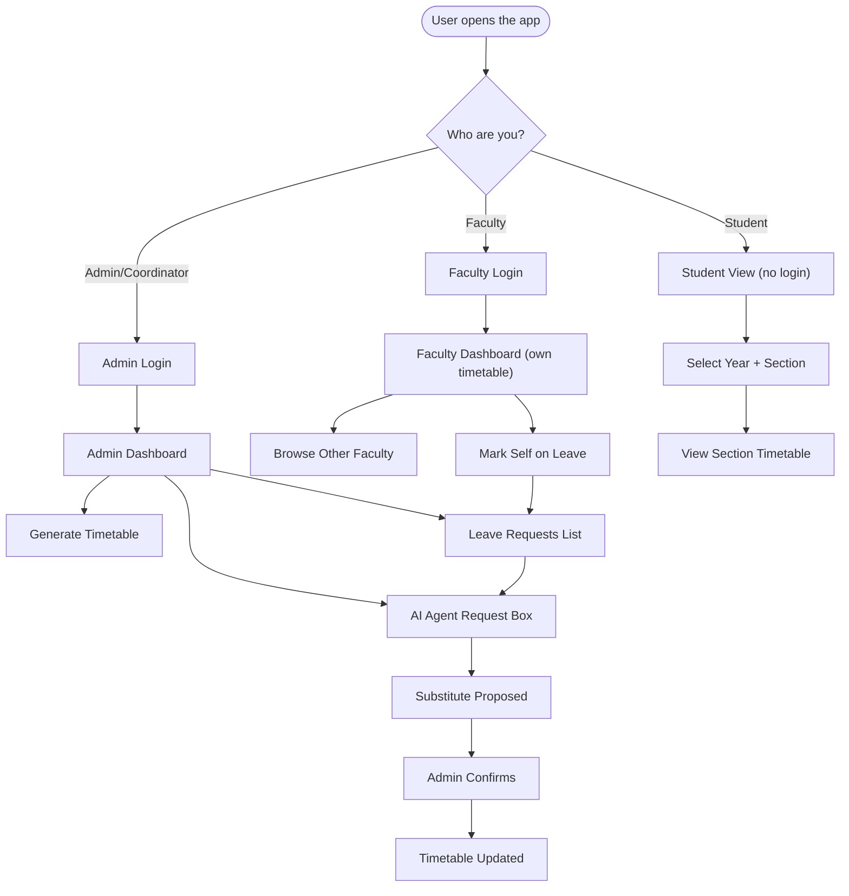

# UI & User Flow — Smart Timetable Auto-Generator

Status: Finalized Day 2. Low-fidelity wireframes — visual polish happens Day 8 per the Blueprint.

## 1. Overall User Flow Diagram



---

## 2. Screen Flow (by role)

### Admin / Coordinator
```
Login Screen
   └──> Admin Dashboard
          ├──> Section Timetable Viewer (tab/dropdown per section)
          ├──> "Generate Timetable" button (+ success/error state)
          ├──> Agent Request Box (text input + confirmation flow)
          ├──> Leave Requests List (pending items → "Resolve via Agent")
          └──> Recent Changes Panel
```

### Faculty
```
Login Screen
   └──> Faculty Dashboard (own timetable, shown by default)
          ├──> Faculty Picker Dropdown → view another faculty's timetable
          └──> "Mark Leave" form (day + period selection)
```

### Student
```
Landing Page (no login)
   └──> Year + Section Dropdown
          └──> Section Timetable Viewer (read-only)
```

---

## 3. Wireframes (low-fidelity, ASCII-style)

### 3.1 Admin Dashboard

```
+--------------------------------------------------------------+
| [Logo] Smart Timetable          Admin: Dr. Rao      [Logout] |
+--------------------------------------------------------------+
| [Generate Timetable]   Section: [ A v ]   [Recent Changes v] |
+--------------------------------------------------------------+
|                     Mon   Tue   Wed   Thu   Fri              |
|  Period 1        | DSA  | Phy  | Math | DSA  | Phy  |         |
|  Period 2        | Math | DSA  | Phy  | Math | DSA  |         |
|  Period 3        | ...  | ...  | ...  | ...  | ...  |         |
|  ...                                                          |
+--------------------------------------------------------------+
|  Describe a change:                                           |
|  [ "Ms. Sharma is absent Monday period 3"          ] [Send]  |
+--------------------------------------------------------------+
|  Leave Requests (2 pending)                                   |
|   • Mr. Verma — Tue, Period 5        [Resolve via Agent]      |
|   • Ms. Iyer — Wed, Period 2         [Resolve via Agent]      |
+--------------------------------------------------------------+
```

### 3.2 Agent Confirmation Modal (appears after typing a request)

```
+----------------------------------------------------+
|  Confirm Action                                [x]  |
+----------------------------------------------------+
|  You're marking Ms. Sharma absent for:               |
|  Section B — Monday, Period 3 (Physics)              |
|                                                       |
|  Suggested substitute: Ms. Verma                     |
|  (free at this time, lowest current weekly load)     |
|                                                       |
|         [ Cancel ]        [ Confirm & Update ]       |
+----------------------------------------------------+
```

### 3.3 Faculty Dashboard

```
+--------------------------------------------------------------+
| [Logo] Smart Timetable        Faculty: Ms. Verma   [Logout]  |
+--------------------------------------------------------------+
| Viewing: [ My Timetable v ]  (dropdown: switch to any faculty)|
+--------------------------------------------------------------+
|                     Mon   Tue   Wed   Thu   Fri              |
|  Period 1        | Phy  | --   | Math | Phy  | --   |         |
|  Period 2        | --   | Phy  | --   | --   | Phy  |         |
|  ...                                                          |
+--------------------------------------------------------------+
|  [ Mark Myself on Leave ]                                     |
|    Day: [ Mon v ]   Period: [ 3 v ]        [ Submit ]         |
+--------------------------------------------------------------+
```

### 3.4 Student View

```
+--------------------------------------------------------------+
| [Logo] Smart Timetable — Student View                        |
+--------------------------------------------------------------+
|  Year: [ 2nd Year (fixed) ]   Section: [ Select v ]           |
+--------------------------------------------------------------+
|                     Mon   Tue   Wed   Thu   Fri              |
|  Period 1        | ...  | ...  | ...  | ...  | ...  |         |
|  ...                                                          |
+--------------------------------------------------------------+
```

---

## 4. Navigation Summary

| Screen | Reachable from | Requires login |
|---|---|---|
| Admin Login | landing / direct link `/admin/login` | no |
| Admin Dashboard | after Admin login | yes (Admin) |
| Faculty Login | landing / direct link `/faculty/login` | no |
| Faculty Dashboard | after Faculty login | yes (Faculty) |
| Student View | landing / direct link `/student` | no |

Every screen maps directly to a role and a PRD user flow (8.1–8.4) — no screen exists without a corresponding functional requirement.
